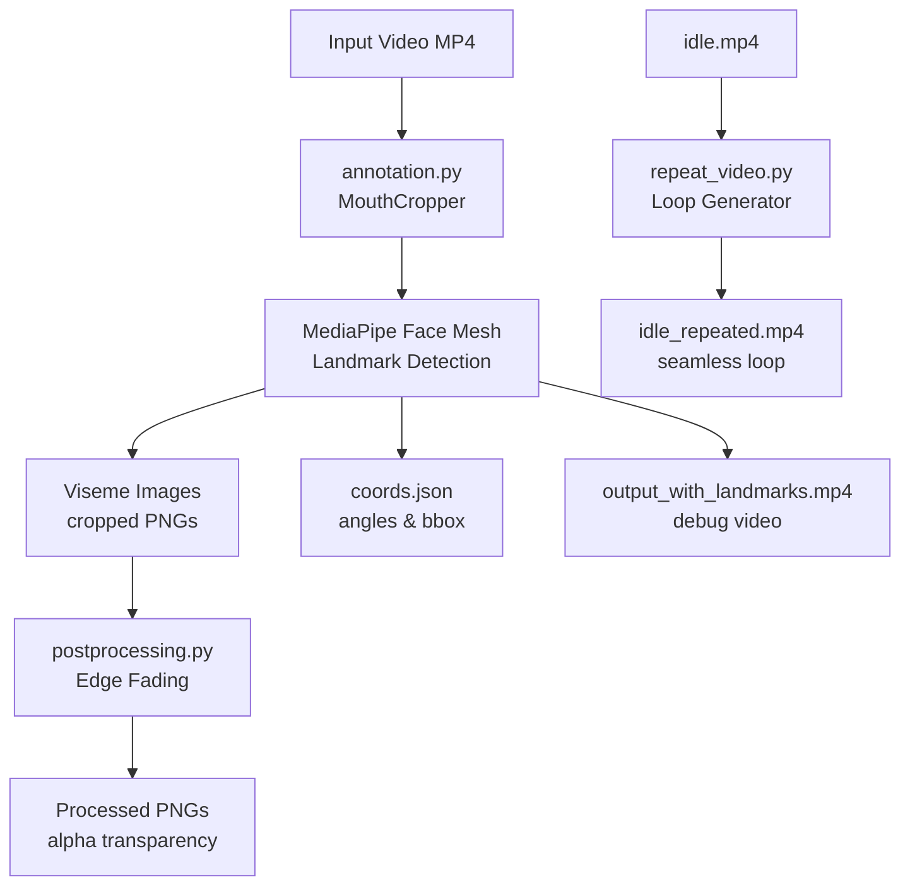

# 🎭 2D Avatar Gautam

A powerful Python-based system that extracts **visemes** (mouth shapes for lip-sync) from video files and generates reusable assets for **2D avatar animation**. This project uses MediaPipe's FaceMesh technology to create smooth, realistic lip-sync animations.

## ✨ Features

- 🎯 **Accurate Viseme Extraction**: Uses MediaPipe FaceMesh for precise mouth landmark detection
- 🖼️ **Automated Image Processing**: Crops and processes mouth regions with transparency effects
- 🔄 **Seamless Animation Loops**: Creates smooth idle animations for natural avatar behavior
- 📊 **Debug Visualization**: Generates annotated videos with facial landmarks for development
- 💾 **Data Export**: Saves timing, coordinates, and angles in structured JSON format

## 📂 Project Structure

```
2D-AVATAR-GAUTAM/
├── visemes/                    # Auto-generated viseme crops
├── output/                     # Processed output files
├── scripts/
│   ├── annotation.py          # Main viseme extraction script
│   ├── postprocessing.py      # Edge fading and transparency effects
│   └── repeat_video.py        # Idle video loop generator
├── assets/
│   ├── Avatar IV Video.mp4    # Input video (face with speech)
│   ├── Avatar IV Video.wav    # Input audio for lip-sync cues
│   └── idle.mp4               # Base idle animation clip
├── data/
│   ├── coords.json           # Mouth coordinates and angles
│   ├── data.json             # Lip-sync timing data
│   └── output_with_landmarks.mp4  # Debug video with landmarks
├── requirements.txt           # Python dependencies
├── .gitignore
└── README.md
```

## 🚀 Quick Start

### Prerequisites

- Python 3.8–3.11 (recommended)
- Webcam or video file with clear face visibility
- Audio file with corresponding speech (optional)

### Installation

1. **Clone the repository:**
   ```bash
   git clone https://github.com/your-username/2D-Avatar-Gautam.git
   cd 2D-Avatar-Gautam
   ```

2. **Install dependencies:**
   ```bash
   pip install -r requirements.txt
   ```

3. **Prepare your input files:**
   - Place your video file (MP4 format recommended)
   - Ensure audio file matches the video (WAV format)
   - Update file paths in the scripts if needed

## ⚙️ Dependencies

The project requires the following Python packages:

```txt
opencv-python>=4.6.0
mediapipe>=0.9.0
numpy>=1.21.0
moviepy>=1.0.3
Pillow>=8.0.0
```

Install all dependencies with:
```bash
pip install -r requirements.txt
```

## 🔧 Usage

### Step 1: Extract Visemes

Run the main annotation script to extract mouth shapes:

```bash
python scripts/annotation.py
```

**What it does:**
- Loads video and lip-sync data (mouthCues with start/end times)
- Uses MediaPipe FaceMesh to detect facial and mouth landmarks
- Crops mouth regions for each unique viseme and saves as PNG
- Stores bounding boxes, angles, and timestamps in `coords.json`
- Creates debug video `output_with_landmarks.mp4` showing:
  - Face mesh landmarks
  - Mouth bounding box overlays
  - Current viseme labels
  - Frame-by-frame analysis

### Step 2: Post-Process Visemes

Apply edge fading for smoother blending:

```bash
python scripts/postprocessing.py
```

**Features:**
- Applies gradient fade effects on viseme edges
- Adds transparency for seamless overlay
- Saves processed images with `_processed.png` suffix
- Maintains original aspect ratios

### Step 3: Generate Idle Loops

Create seamless idle animations:

```bash
python scripts/repeat_video.py
```

**Output:**
- Doubles idle video length by smart concatenation
- Produces `idle_repeated.mp4` with smooth transitions
- Prevents jarring loops in avatar animations

## 📊 Output Files

| File Type | Location | Description |
|-----------|----------|-------------|
| **Viseme Images** | `/visemes/` | Cropped mouth PNGs for each phoneme |
| **Debug Video** | `/output/output_with_landmarks.mp4` | Annotated video with landmarks |
| **Coordinates** | `/data/coords.json` | Bounding boxes and rotation angles |
| **Processed Images** | `/visemes/` | Edge-faded PNGs with transparency |
| **Idle Animation** | `/output/idle_repeated.mp4` | Extended idle loop video |

## 🏗️ System Architecture



## 🔄 Data Flow Pipeline

```
[Start] → Load Video + Lip Sync Data
    ↓
Run MediaPipe FaceMesh → Detect Landmarks
    ↓
Extract Mouth Bounding Box
    ↓
┌─── Crop Mouth Region → Save Viseme.png
├─── Calculate Angles + Coords → Save coords.json  
└─── Draw Debug Landmarks → Save Debug Video
    ↓
[Optional] Post-Processing → Fade PNG Edges
    ↓
[Optional] Repeat Video → Extend Idle Animation
    ↓
[Complete] → Ready for Avatar Integration
```

## 🔮 Advanced Features & Extensions

### Planned Improvements

- **Multi-Speaker Support**: Handle multiple viseme sets for different voices
- **Real-Time Processing**: Live viseme extraction from webcam feed
- **Template Integration**: Direct replacement of mouth regions in avatar templates
- **Smart Blending**: Crossfade transitions instead of hard loops for idle animations
- **Speech-to-Viseme**: Automatic phoneme mapping from audio analysis
- **Batch Processing**: Handle multiple video files simultaneously

### Configuration Options

Create a `config.json` file to customize extraction parameters:

```json
{
  "face_detection": {
    "min_detection_confidence": 0.5,
    "min_tracking_confidence": 0.5,
    "max_num_faces": 1
  },
  "mouth_cropping": {
    "padding": 20,
    "min_mouth_size": 30,
    "output_size": [128, 128]
  },
  "post_processing": {
    "fade_pixels": 10,
    "transparency_threshold": 0.1
  }
}
```

## 🐛 Troubleshooting

### Common Issues

**"No face detected in video"**
- Ensure good lighting and clear face visibility
- Check video quality and resolution
- Verify MediaPipe installation

**"ModuleNotFoundError"**
- Run `pip install -r requirements.txt`
- Check Python version compatibility (3.8-3.11)

**"Empty visemes folder"**
- Verify input video has audio/speech
- Check lip-sync timing data format
- Ensure mouth movement is visible

### Performance Optimization

- Use MP4 format for better compatibility
- Reduce video resolution for faster processing
- Enable GPU acceleration if available:
  ```bash
  pip install opencv-python-headless
  ```

## 📄 License

This project is licensed under the MIT License - see the [LICENSE](LICENSE) file for details.

## 🤝 Contributing

Contributions are welcome! Please feel free to submit a Pull Request. For major changes, please open an issue first to discuss what you would like to change.

1. Fork the repository
2. Create your feature branch (`git checkout -b feature/AmazingFeature`)
3. Commit your changes (`git commit -m 'Add some AmazingFeature'`)
4. Push to the branch (`git push origin feature/AmazingFeature`)
5. Open a Pull Request

## 📞 Support

If you encounter any issues or have questions:

- 📧 Email: [your-email@example.com]
- 🐛 Issues: [GitHub Issues](https://github.com/your-username/2D-Avatar-Gautam/issues)
- 📖 Documentation: [Wiki](https://github.com/your-username/2D-Avatar-Gautam/wiki)

---

**Made with ❤️ for the animation and AI community**
